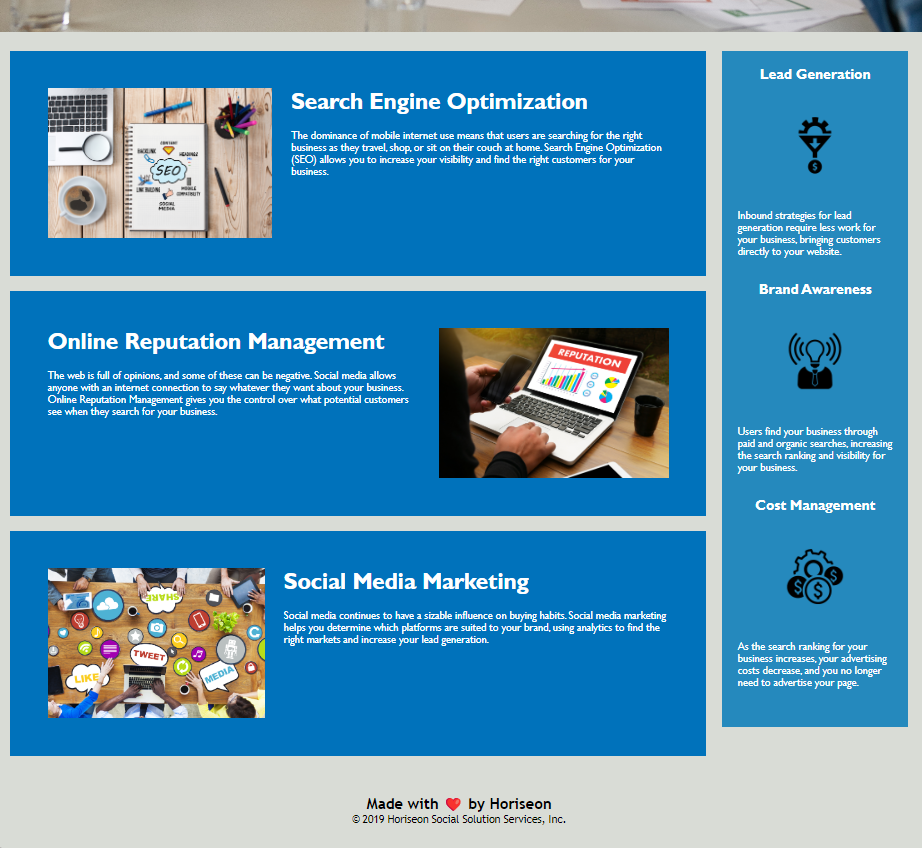

# <Horiseon-Code-Refactor>

## Description

AS A Bootcamp Student 
I WANT TO create a codebase that follows acessibilty standards 
SO THAT this site is optimized for web searches

## Usage

This project cleaned up the webpage for a firm. It simplfied their code and allowed it to nicely fit and style on the page.

---

